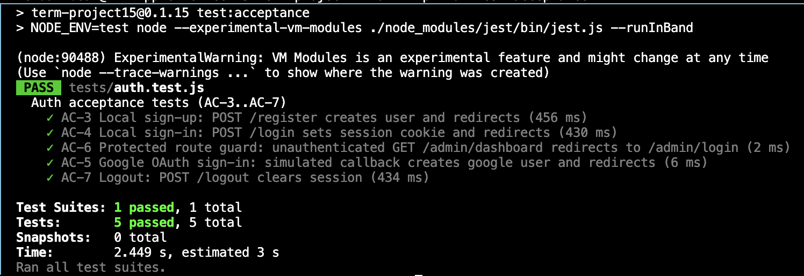

# Hilo Eco-Tourism Rental Full-Stack Website
 A Hilo, Hawaii vacation rental marketing site with a visitor dashboard and admin-only dashboard for site information.

Live URL (Render): https://ics385spring26-kbeam.onrender.com/
** google sign in is broken currently

## Setup

1) Clone the repo
2) Install dependencies *at cwd of package.json*

```bash
npm install && npm update
# ^^ npm ci if dependencies are off
```

3) Create environment file

```bash
cp .env.example .env

#populate .env with required variables (MONGO_URI, PORT, VITE_WEATHER_KEY, GOOGLE_CLIENT_ID, GOOGLE_CLIENT_SECRET, SESSION_SECRET)
```

4) Start the server

```bash
npm run build && npm start
# create the /dist folder, spin up the server
```
or for development
```bash
npm run dev
# or
npm run build && npm run preview
# ^^ create the /dist folder ^^ 
```

5) Seed data (optional)

```bash
npm run seed
# populate mongodb instance w/ data
```

### Admin account note

There is no admin account on first run. Create one manually (e.g., via a Node script or a temporary route) and set {role: 'admin'}. If the email later signs in with Google OAuth, the account should link by matching email.

## Tech Stack

- Frontend: React, Vite, Chart.js, react-chartjs-2
- Backend: Node.js, Express, Helmet, dotenv
- Auth & Sessions: Passport (local + Google OAuth 2.0), express-session, connect-mongo, bcrypt
- Database: MongoDB, Mongoose
- Tooling & Testing: ESLint, Jest, Supertest, mongodb-memory-server
- Deployment: Render

## File Tree + How It Fits Together

- Backend entry: [server.js](server.js) starts the Express app, wires middleware, and mounts the route modules under `routes/`.
- Auth config: [passport-config.js](passport-config.js) sets up local + Google strategies used by the auth routes.
- Routes: [routes/](routes/) splits API concerns into [routes/auth.js](routes/auth.js) (login/register/OAuth), [routes/admin.js](routes/admin.js) (admin dashboard endpoints), and [routes/properties.js](routes/properties.js) (property/volcano data).
- Middleware: [middleware/](middleware/) includes [middleware/isAuthenticated.js](middleware/isAuthenticated.js) and [middleware/isAdmin.js](middleware/isAdmin.js) to guard protected routes.
- Data models: [models/](models/) defines Mongoose schemas for users and domain data.
- Seeds: [seed/](seed/) provides scripts to populate data; [seed-admin.js](seed-admin.js) is a helper for creating an initial admin account if needed.
- Frontend entry: [index.html](index.html) bootstraps the Vite app and loads [src/index.jsx](src/index.jsx), which imports [src/styles.css](src/styles.css) and the React components in [src/components/](src/components/).
- Assets: [public/](public/) hosts static assets copied into the Vite build.
- Tests: [tests/](tests/) contains Jest + Supertest acceptance tests for backend auth.
- Docs: [docs/](docs/) stores seed data and the test output screenshot.


## AI Tools Used

- GitHub Copilot: debugging, scaffolding files, CSS assistance, and feature implementation during the short development. Scaffolding the README for time.

I can explain every line of generated code and why it was included.
All documentation is my own.

## Acceptance Criteria Results (HW15-B)

| Acceptance Criterion | Result | Notes |
| --- | --- | --- |
| AC-1 Public marketing page: GET / returns 200 and renders property name, hero image, and at least 3 amenities | Pass | Verified via manual check |
| AC-2 Visitor dashboard: GET /dashboard renders 3 Chart.js visualizations with non-empty data | Pass** | One chart uses 3 options |
| AC-3 Local sign-up: POST /register creates user and redirects | Pass | Tests: 456 ms |
| AC-4 Local sign-in: POST /login sets session cookie and redirects | Pass | Tests: 430 ms |
| AC-5 Google OAuth sign-in: simulated callback creates Google user and redirects | Pass | Tests: 6 ms |
| AC-6 Protected route guard: unauthenticated GET /admin/dashboard redirects to /admin/login | Pass | Tests: 2 ms |
| AC-7 Logout: POST /logout clears session | Pass | Tests: 434 ms |
| AC-8 Secret hygiene: .env absent, .env.example present, no API keys in repo | Pass | Verified via repo check |
| AC-9 Load time: most content renders within 500 ms | Pass | Manual observation |

** design got cut down to one chart, but has 3 modes

## Tests

Run acceptance tests:

```bash
npm run test:acceptance
```

## Test Output Screenshot


